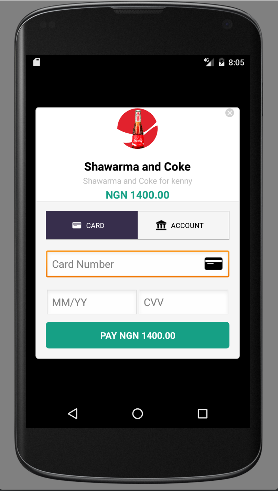
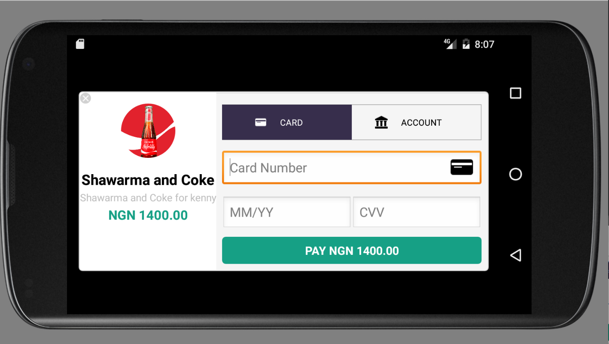
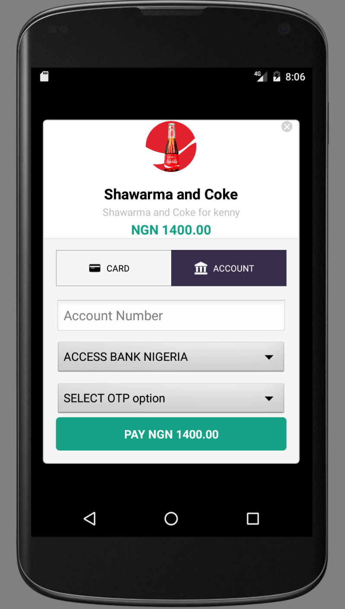
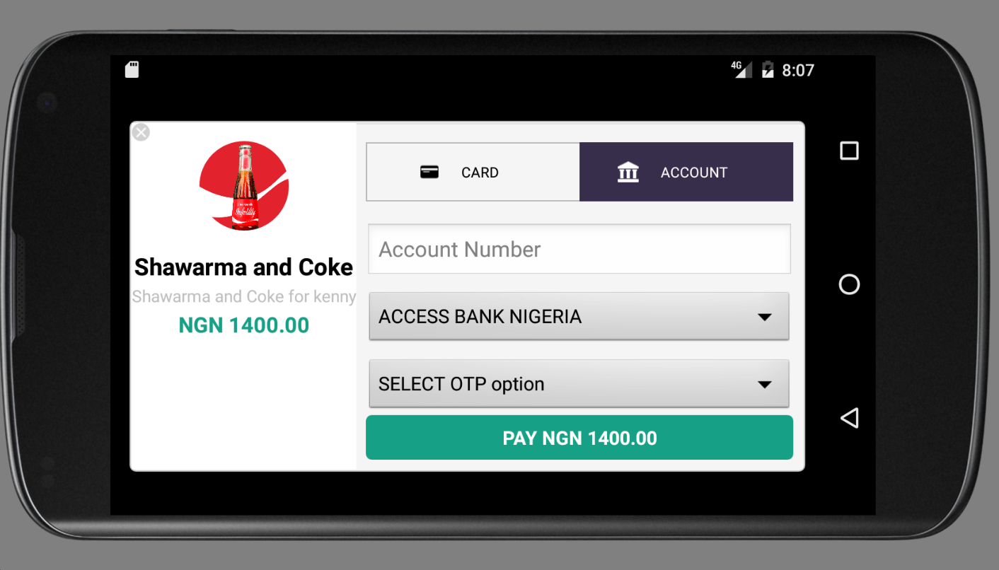

# Rave
Rave is an android plugin for interacting with the Flutterwave payment api. It's easy to use and integrate into you existing project. Also, it takes away the extra UI design work, Rave has a nice custom dialog box (both portrait & landscape) for collecting transaction details from users.

## Design

***







## Dependencies

Rave has the following dependencies

     compile 'commons-codec:commons-codec:1.10'
     compile 'com.google.guava:guava:19.0'
     compile 'com.squareup.okhttp3:okhttp:3.5.0'
     compile 'com.fasterxml.jackson.core:jackson-databind:2.7.2'


Note : You don't have to add these dependencies yourself, they've already been added to gradle within the raveModule.


## Installation

Rave can be added to you project manually by adding the raveModule folder to you project root directory.
Then add `compile project(":raveModule")` to your dependencies in build.gradle at app level.

We hope to make rave available on Maven repo and Jcenter soon.


## How to use

You can call Rave within your activity as shown below.
```
public class MainActivity extends AppCompatActivity {

    private Button raveButton;

    @Override
    protected void onCreate(Bundle savedInstanceState) {
        super.onCreate(savedInstanceState);

        setContentView(R.layout.activity_main);
        raveButton = (Button)findViewById(R.id.rave_btn);

        raveButton.setOnClickListener(new View.OnClickListener() {
            @Override
            public void onClick(View v) {
                // create rave data object
                // All Constructor parameters must be provided.
                RaveData raveData = new RaveData.Builder(
                        "Shawarma and Coke", // item name
                        "Shawarma and Coke for kenny", // item description
                        1400.00, // item price
                        "FLWPUBK-XXXXX", // public key
                        "FLWSECK-XXXXX", // secret key
                        "test@gmail.com", // buyer's email address
                        "FLW-TXREF-XXXXX" // tx-ref)
                        .build();

                // initialize RaveDialog using RaveData object created above and call show() to display dialog.
                RaveDialog rave = new RaveDialog(MainActivity.this, raveData);
                rave.show();
            }
        });
    }
}
```

You can also specify custom values for RaveData optional parameters as shown below
```
                Bitmap bitmap = BitmapFactory.decodeResource(getResources(), R.drawable.coke);

                // create rave data object
                // All Constructor parameters must be provided.
                RaveData raveData = new RaveData.Builder(
                        "Shawarma and Coke", // item name
                        "Shawarma and Coke for kenny", // item description
                        1400.00, // item price
                        "FLWPUBK-XXXXX", // public key
                        "FLWSECK-XXXXX", // secret key
                        "test@gmail.com", // buyer's email address
                        "FLW-TXREF-XXXXX" // tx-ref)

                        // optional parameters
                        .withItemImage(bitmap)
                        .withCountry("Nigeria")
                        .withCurrency("NGN")
                        .withFirstName("fname")
                        .withLastName("lname")
                        .withIp("127.0.0.1")
                        .withMeta(Lists.<Map<String,Object>>newArrayList())
                        .withNarration("Narration")
                        .build();
```

